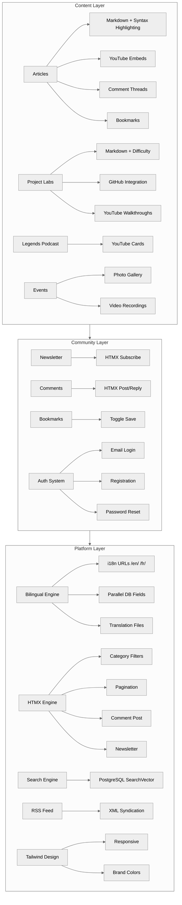
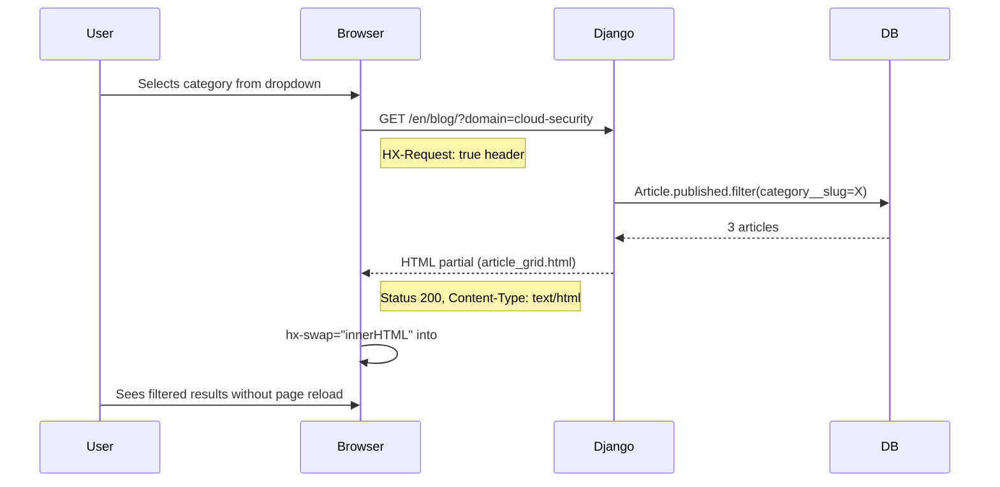

# Software Requirements Specification

## Cyber With Taptue — Open-Source Cybersecurity Education Platform

> **Vision**: *"Making cybersecurity accessible to everyone — breaking down paywalls, language barriers, and elitism to build the largest free, bilingual cybersecurity knowledge commons."*
>
> — Taptue Russel, Founder

---

**Version**: 2.1  
**Date**: 2026-06-05  
**Author**: Taptue Russel  
**Status**: Draft  
**Classification**: Internal

---

## Table of Contents

1. [Executive Summary](#1-executive-summary)
2. [Strategic Context](#2-strategic-context)
3. [Product Overview](#3-product-overview)
4. [User Personas & Journeys](#4-user-personas--journeys)
5. [Functional Requirements](#5-functional-requirements)
6. [Non-Functional Requirements](#6-non-functional-requirements)
7. [Data Model](#7-data-model)
8. [User Interface & Design System](#8-user-interface--design-system)
9. [Architecture & Technical Design](#9-architecture--technical-design)
10. [Content Engineering](#10-content-engineering)
11. [Security & Compliance](#11-security--compliance)
12. [Testing Strategy](#12-testing-strategy)
13. [Phased Roadmap](#13-phased-roadmap)
    - [Phase 1 — Foundation](#phase-1--foundation)
    - [Phase 2 — Quality & Growth](#phase-2--quality--growth)
    - [Phase 3 — Community Features](#phase-3--community-features)
    - [Phase 4 — Scale & Optimization](#phase-4--scale--optimization)
14. [Appendices](#14-appendices)

---

## 1. Executive Summary

### 1.1 The Problem

Cybersecurity education today suffers from three critical failures:

| Failure | Impact |
|---------|--------|
| **Cost barrier** | Quality resources are locked behind paywalls ($500–$5,000/course), excluding the vast majority of aspiring professionals globally |
| **Language gap** | 80%+ of cybersecurity content is English-only, excluding 1.5B+ French speakers across Africa, Europe, and Canada |
| **Theory/practice divide** | Certifications teach theory; real-world security operations require hands-on experience with SIEM, firewalls, hardening, and incident response |

### 1.2 The Solution

Cyber With Taptue (CWT) is a **free, open-source, bilingual (EN/FR) cybersecurity education platform** that bridges the gap between academic theory and real-world practice through:

- **Hardened practical content**: Production-grade server hardening guides, SIEM lab builds, forensic investigation walkthroughs — all tested and reproducible
- **Bilingual by design**: Every article, lab, and podcast episode available in English and French, served under language-prefixed URLs (`/en/`, `/fr/`)
- **Community architecture**: Comment threads (with threaded replies), newsletter subscriptions, bookmarks, reading lists, and event listings that transform passive readers into an active learning community
- **Full account management**: Email-only registration, login, and password reset — no third-party OAuth, no paid authentication services
- **Zero cost, maximum quality**: All content is open-source on GitHub, free to access, and licensed for reuse. All infrastructure uses free, open-source software and free-tier services.

### 1.3 Target Audience

| Segment | Size (est.) | Need |
|---------|-------------|------|
| French-speaking African IT professionals | 500M+ | Accessible cybersecurity training in their native language |
| Career switchers (engineering → security) | Growing | Practical labs to build portfolio evidence |
| CS students (francophone universities) | 2M+ | Free supplemental hands-on material |
| English-speaking global learners | Unlimited | High-quality open-source security content |

---

## 2. Strategic Context

### 2.1 Competitive Landscape

| Competitor | Strengths | Weaknesses | CWT Advantage |
|------------|-----------|------------|---------------|
| TryHackMe | Gamified labs, large community | Paid subscription required, English-only | Free + bilingual |
| HackTheBox | Advanced challenges, CTFs | Steep learning curve, paid tiers | Beginner-friendly + production-focused |
| Cisco NetAcad | Structured curriculum | Expensive ($200+/course), English | Free, self-paced, community-driven |
| YouTube security channels | Free, video format | No structure, no community features | Structured + bilingual articles + video + community |
| OWASP | Authoritative, open-source | Reference-only, no tutorials | Practical step-by-step guides + interactive labs |

### 2.2 Key Differentiators

1. **Native bilingual architecture** — Not an afterthought translation; every content model has parallel `_fr` fields, every template string is in `.po` files. A learner in Abidjan or Montreal gets the same quality as a learner in London.
2. **Production-grade, not toy labs** — The seed article is a complete Debian 12 hardening guide covering nftables, sysctl, auditd, fail2ban, and SSH key-only auth. This isn't a "click here" tutorial — it's a production deployment manual.
3. **Open-source DNA** — All code on GitHub (`russel-taptue`), all content in Markdown, no proprietary lock-in. The platform itself is a Django reference architecture.
4. **Multi-format content model** — Articles (deep dives), project labs (hands-on), podcast episodes (career stories), events (community gatherings) — covering every learning modality.

### 2.3 Success Metrics (Phase 1 Targets)

| Metric | Target (6 months) | Measurement |
|--------|-------------------|-------------|
| Monthly Active Users | 5,000 | Django analytics middleware |
| Published articles | 20 | Admin panel count |
| Newsletter subscribers | 1,000 | NewsletterSubscriber table |
| French-language engagement | 40% of total traffic | Language-prefix URL analytics |
| Average session duration | >4 minutes | Analytics |
| Comment-to-article ratio | >0.5 comments/article | Comment count / published articles |
| Password reset success rate | >90% | Reset emails sent vs. successful resets |
| Newsletter delivery rate | >95% | Bounce rate from SMTP logs |

---

## 3. Product Overview

### 3.1 Platform Capabilities (Feature Map)



### 3.2 Scope Boundaries

| In Scope (Phase 1) | Out of Scope (Phase 1) |
|--------------------|----------------------|
| Server-rendered Django templates | Single-page application (SPA) |
| HTMX for dynamic interactions | React, Vue, or Alpine.js |
| PostgreSQL database | MongoDB or other NoSQL |
| Bilingual EN/FR | Additional languages |
| Email-only authentication | OAuth, SSO, MFA, social login |
| Manual content publishing via admin | Scheduled publishing, editorial workflows |
| Newsletter via database table + Django SMTP | External ESP integration (Mailchimp, SendGrid) |
| Local image uploads | S3/CDN image hosting |
| Basic comment moderation | Spam detection, profanity filter |
| YouTube video embedding | Self-hosted video streaming |
| Local PostgreSQL or SQLite | Managed cloud databases |

### 3.3 Architecture Principles

| Principle | Rationale |
|-----------|-----------|
| **Server-rendered first** | SEO-critical for educational content to rank in search engines |
| **Progressive enhancement** | HTMX adds dynamism; everything works with JS disabled (except newsletter POST) |
| **Idempotent seeding** | The seed command can be run any number of times with identical results |
| **Bilingual at the database level** | Content translations stored as parallel columns (`title`/`title_fr`), not external tables — simpler queries, no JOIN overhead |
| **Zero cost, zero vendor lock-in** | All infrastructure choices (PostgreSQL, Django, Tailwind, Gunicorn, Nginx) are open-source and free. No paid services required at any scale. Email delivery uses free SMTP tiers. |

---

## 4. User Personas & Journeys

### 4.1 Personas

#### Persona A: Amara — The Francophone Career Switcher

| Attribute | Detail |
|-----------|--------|
| **Age** | 28 |
| **Location** | Abidjan, Côte d'Ivoire |
| **Background** | Electrical engineering graduate, 4 years in telecom |
| **Goal** | Transition to cybersecurity; build portfolio to land first SOC analyst role |
| **Pain points** | Limited English proficiency, can't afford $500+ courses, needs hands-on projects |
| **Device** | Mid-range Android phone + shared laptop |

**Success path**: Discovers CWT via French search → reads "Hardening Debian 12" in French → follows step-by-step → deploys on a cheap VPS → adds to CV → gets interviewed.

#### Persona B: David — The Open-Source Contributor

| Attribute | Detail |
|-----------|--------|
| **Age** | 34 |
| **Location** | Montreal, Canada |
| **Background** | DevOps engineer, 10 years experience |
| **Goal** | Give back to community, practice documentation writing in French |
| **Pain points** | No structured way to contribute, wants bilingual platform to practice French tech writing |
| **Device** | MacBook Pro, dual monitors |

**Success path**: Finds CWT GitHub → reads contributing guidelines → submits PR with French translation → becomes regular contributor → builds reputation.

#### Persona C: Fatima — The CS Student

| Attribute | Detail |
|-----------|--------|
| **Age** | 21 |
| **Location** | Dakar, Senegal |
| **Background** | Computer Science undergraduate |
| **Goal** | Supplement university curriculum with practical security labs |
| **Pain points** | University teaches theory only; no lab environment; limited English |
| **Device** | University computer lab, intermittent internet |

**Success path**: Professor recommends CWT → Fatima works through SIEM lab project over a semester → uses the project lab as capstone → graduates with portfolio.

#### Persona D: James — The Self-Taught Hobbyist

| Attribute | Detail |
|-----------|--------|
| **Age** | 19 |
| **Location** | Nairobi, Kenya |
| **Background** | High school graduate, self-taught Python |
| **Goal** | Learn cybersecurity fundamentals, build home lab |
| **Pain points** | No mentorship, no community, overwhelmed by options |
| **Device** | Personal laptop, mobile hotspot |

**Success path**: Finds CWT blog → reads getting-started articles → watches Meet the Legends podcast for career inspiration → subscribes to newsletter → joins comment discussions.

### 4.2 Key User Journeys

#### Journey 1: First Visit → Newsletter Subscriber

```
Home Page → reads hero tagline → clicks "Explore Articles" 
  → Blog page → scans article cards → clicks "Hardening Debian 12" 
    → Article detail → reads content impressed → scrolls to comments 
      → sees "Join the conversation — log in or sign up to leave a comment" 
        → goes to Contact page → enters email → HTMX success message 
          → NewsletterSubscriber created
```

**Touchpoints**: Home → Blog → Article Detail → Contact  
**Success metric**: Newsletter subscription rate >2% of unique visitors

#### Journey 2: French-Speaking Learner → Community Member

```
Google search: "guide securisation serveur debian 12" 
  → Lands on /fr/blog/debian-12-bookworm-server-installation/
    → Reads full article in French → impressed by quality 
      → Clicks language switcher → sees English version → compares
        → Returns to French → clicks "S'abonner" on /fr/contact/
          → Receives monthly newsletter → engages with comments
```

**Touchpoints**: External search → French article → Language switcher → Contact  
**Success metric**: French session completion rate = EN rate (parity target)

#### Journey 3: Admin Publishing Workflow

```
Logs in at /admin/ → Django Admin Dashboard 
  → Clicks "Articles" → "Add Article" 
    → Fills title, title_fr, content (Markdown), content_fr, category, etc.
      → Sets is_published = True → saves 
        → Article appears on /en/blog/ and /fr/blog/ immediately
          → Promotes on social media → monitors comments via admin
```

**Touchpoints**: Admin login → ArticleAdmin → CRUD operations  
**Success metric**: Time-to-publish < 5 minutes per article

---

## 5. Functional Requirements

### 5.1 Requirement Notation

Each requirement uses the format:
> **`[Module]-[ID]`** — **Title** — *Priority* — **Acceptance Criteria**

**Priority levels**: 🔴 Critical | 🟡 High | 🟢 Medium | 🔵 Low

---

### 5.2 Module: Home Page (`HOME`)

| ID | Requirement | Prio | Acceptance Criteria |
|----|-------------|------|-------------------|
| **HOME-01** | Hero section with gradient background from `slate-900` via `brand-950` to `slate-900` | 🔴 | Visual inspection confirms gradient; pattern overlay SVG present |
| **HOME-02** | Display tagline "Cybersecurity Simplified" with "Cybersecurity" in white and "Simplified" in `cyber` gradient (`from-cyber-400 to-cyber-300`) | 🔴 | Text renders correctly under both EN and FR; `` tags present |
| **HOME-03** | Two CTA buttons: "Explore Articles" → `` and "Try Labs" → `` | 🔴 | Buttons render with `bg-cyber-500` and `bg-slate-800` styles; links resolve to 200 |
| **HOME-04** | Page title tag: "Cyber With Taptue — Learn, Protect, Share" translatable via `` | 🔴 | `/en/` shows English title; `/fr/` shows French translation in `<title>` |
| **HOME-05** | All user-facing text wraps in `` with corresponding entries in `django.po` | 🔴 | Missing translation check fails for all strings on this page |

---

### 5.3 Module: About Us (`ABOUT`)

| ID | Requirement | Prio | Acceptance Criteria |
|----|-------------|------|-------------------|
| **ABOUT-01** | Founder bio card: name "Taptue Russel", title "Founder & Cybersecurity Consultant", subtitle "CCMC \| IT Professional" | 🔴 | Card renders with Tailwind styling; all text translatable |
| **ABOUT-02** | "The Story Behind Cyber With Taptue" section with 2-paragraph narrative describing the founding motivation | 🟡 | Both paragraphs render; content is bilingual via `` |
| **ABOUT-03** | "Our Mission" section with exactly 4 bullet points: education, community, open-source, bridge gap | 🟡 | 4 `<li>` elements rendered; content matches spec |
| **ABOUT-04** | "What We Offer" section with 4 feature cards: Hands-On Labs, Open Source, Bilingual, Community | 🟡 | 4 cards in grid; each has title, description; responsive layout |
| **ABOUT-05** | Stats/metrics showcase row: "Hands-On Labs" subtitle "Real environments, real tools, real skills" and similar for 3 others | 🟢 | 4 stat items rendered; translations present |
| **ABOUT-06** | Bottom CTA banner: "Ready to Start Your Cybersecurity Journey?" with "Browse Articles" and "View Projects" buttons | 🟢 | Banner has distinct background; buttons link to correct URLs |
| **ABOUT-07** | Mobile responsive: cards stack vertically below `md` breakpoint | 🔴 | Test at 375px viewport; all content readable without horizontal scroll |

---

### 5.4 Module: Blog (`BLOG`)

| ID | Requirement | Prio | Acceptance Criteria |
|----|-------------|------|-------------------|
| **BLOG-01** | `ArticleListView` returns published articles ordered by `-published_at`, then `-created_at` | 🔴 | Query returns `Article.published.all().order_by('-published_at', '-created_at')` |
| **BLOG-02** | Category filter `<select>` populated from `Category.objects.all()` ordered by `order`, then `name` | 🔴 | Dropdown includes "All Domains" default + all categories; filter applies domain= param |
| **BLOG-03** | Category filter uses HTMX: `hx-get`, `hx-target="#article-grid-container"`, `hx-swap="innerHTML"`, `hx-trigger="change"` | 🔴 | Network tab shows HTMX request on change; response is partial template, not full page |
| **BLOG-04** | Loading indicator with `id="loading-indicator"` and `class="htmx-indicator"` | 🟡 | Spinner visible during HTMX request; hidden on completion |
| **BLOG-05** | Article cards display: featured image, category badge (`bg-brand-100 text-brand-700`), reading time badge, title, excerpt (truncated), author, date | 🔴 | Card renders all 7 elements; `{{ article.excerpt\|truncatewords:30 }}` applied |
| **BLOG-06** | Pagination: 9 articles per page; Previous/Next links; uses HTMX with `hx-target="#article-grid-container"` | 🔴 | Page 1 shows 9 articles; page 2+ loads via HTMX; Previous disabled on page 1 |
| **BLOG-07** | Pagination label: `Page {{ current }} of {{ total }}` | 🟡 | "Page 1 of 3" renders; French shows "Page 1 sur 3" |
| **BLOG-08** | Empty state message: "No articles found. Try selecting a different domain." | 🟢 | No articles matching filter shows this message |
| **BLOG-09** | `ArticleDetailView` renders `{{ article.content\|render_markdown }}` with syntax highlighting via highlight.js | 🔴 | Code blocks have `language-*` classes; highlight.js initializes on page load |
| **BLOG-10** | YouTube video embed section renders only when `article.youtube_video_id` is non-empty | 🟡 | Article with video shows embed; article without hides the section |
| **BLOG-11** | Reading time displayed as "X min read" translatable via `` | 🔴 | `/en/` shows "20 min read"; `/fr/` shows "20 min de lecture" |
| **BLOG-12** | Comment section loads via `` with `article.comments.all` | 🟡 | Comment list renders below article content; empty state shows "No comments yet" |
| **BLOG-13** | Comment form visible only to authenticated users; unauthenticated see "Join the conversation — log in or sign up to leave a comment." | 🔴 | `` wraps form; else shows login prompt |
| **BLOG-14** | Comment form submits via HTMX: `hx-post="" hx-target="#comments-section" hx-swap="outerHTML"` | 🟡 | POST request returns updated `comment_list.html` partial; page does not reload |
| **BLOG-15** | Duplicate comment prevention: form resets after successful POST | 🟢 | After successful post, textarea clears; success indicator shown |
| **BLOG-16** | SEO: `<meta name="description">` uses `article.excerpt`; `<title>` uses `article.title` | 🟡 | Page source shows excerpt in meta description; title in `<title>` tag |

---

### 5.5 Module: Projects / Labs (`PROJ`)

| ID | Requirement | Prio | Acceptance Criteria |
|----|-------------|------|-------------------|
| **PROJ-01** | `ProjectListView` returns published projects ordered by `-published_at`, then `-created_at` | 🔴 | PublishedManager active; ordering verified |
| **PROJ-02** | Category filter identical pattern to BLOG-02/BLOG-03/BLOG-04 | 🔴 | Dropdown uses HTMX; targets `#project-grid` |
| **PROJ-03** | Project cards display: featured image, category badge, difficulty badge (color-coded: green=Beginner, yellow=Intermediate, red=Advanced), title, summary | 🔴 | All elements present; difficulty colors match spec |
| **PROJ-04** | Project cards show GitHub and YouTube icon links if respective fields are non-empty | 🟢 | Icons are `svg` inline; GitHub icon links to `project.github_url` |
| **PROJ-05** | Pagination: 9 projects per page; HTMX-powered; matches pattern in BLOG-06 | 🔴 | Same structure as article pagination |
| **PROJ-06** | Empty state: "No projects found. Try selecting a different category." | 🟢 | Shown when filtered results empty |
| **PROJ-07** | `ProjectDetailView` renders Markdown content with highlight.js | 🔴 | Same pipeline as articles |
| **PROJ-08** | Skills section: split `skills_acquired` by comma → render as `<span>` tags with `bg-brand-100` style | 🟡 | Each skill is an individual tag; uses `{{ project\|translated_field:"skills_acquired"\|split:"," }}` |
| **PROJ-09** | Difficulty badge in detail page header; larger than card version | 🟢 | Badge matches color code; positioned next to category badge |
| **PROJ-10** | "View on GitHub" button: `` → renders styled `<a>` with GitHub icon + text | 🟡 | Button opens in new tab (`target="_blank" rel="noopener"`) |
| **PROJ-11** | YouTube embed section: `` → renders 16:9 responsive iframe | 🟡 | Iframe has `w-full aspect-video` Tailwind classes |

---

### 5.6 Module: Meet the Legends (`LEGEND`)

| ID | Requirement | Prio | Acceptance Criteria |
|----|-------------|------|-------------------|
| **LEGEND-01** | `LegendListView` returns `Legend.published.all()` ordered by `-published_at`, then `-created_at` | 🔴 | View uses `model = Legend`; queryset verified |
| **LEGEND-02** | Card grid layout: `grid grid-cols-1 md:grid-cols-2 lg:grid-cols-3 gap-6` with auto-sized cards | 🔴 | 1 col on mobile; 2 on tablet; 3 on desktop |
| **LEGEND-03** | Each card shows: expert name (`legend.name`), headline via `translated_field:"headline"`, YouTube thumbnail (`https://img.youtube.com/vi/ID/maxresdefault.jpg`), play button SVG overlay | 🔴 | Thumbnail loads; play button centered; headline translated |
| **LEGEND-04** | Click-to-play: clicking thumbnail/play button calls `loadCardVideo(el, videoId)` which hides thumbnail, shows iframe with `autoplay=1` | 🟡 | Video plays without page reload; each card operates independently |
| **LEGEND-05** | Narrative description below video area: `{{ legend\|translated_field:"narrative" }}` | 🟡 | Description text present; matches active language |
| **LEGEND-06** | Empty state: "No legends yet. Featured episodes are being prepared. Check back soon." | 🔵 | Shown when `` is false |
| **LEGEND-07** | `loadCardVideo` function uses `parentElement` traversal, not fragile element IDs | 🟡 | Code review confirms no ID-based selectors in the function |

---

### 5.7 Module: Events (`EVENT`)

| ID | Requirement | Prio | Acceptance Criteria |
|----|-------------|------|-------------------|
| **EVENT-01** | `EventListView` returns `Event.published.all()` ordered by `-start_date` | 🔴 | Event with latest start_date appears first |
| **EVENT-02** | Event cards display: date range (format "DD Mon YYYY" or range), calendar icon, title, venue with map pin icon, summary | 🟡 | Icons are Tailwind-compatible SVGs or emoji |
| **EVENT-03** | Empty state: "No events yet. Check back soon for upcoming cybersecurity events." | 🟢 | Shown when no published events |
| **EVENT-04** | `EventDetailView` has hero section with gradient overlay (`from-brand-900 to-brand-950 opacity-95`) | 🟡 | Visual inspection; hero extends full width |
| **EVENT-05** | Event badges in hero: start/end date, venue, patronage (if set) | 🟡 | Badges are rounded `bg-white/10 backdrop-blur-sm` style |
| **EVENT-06** | Two-column content layout: left column = rendered Markdown recap; right column sidebar = YouTube recording card + photo gallery | 🟡 | Uses `lg:col-span-2` and `lg:col-span-1` grid |
| **EVENT-07** | Photo gallery: iterates `event.photo_gallery` JSON array → renders images with `` | 🟡 | Gallery grid `grid-cols-2 gap-2`; each image has `alt="Event photo"` |
| **EVENT-08** | Event details sidebar card: shows start date, end date, venue with translated labels | 🟢 | Styled as a card with `bg-slate-50 rounded-xl` |
| **EVENT-09** | All event fields bilingual: `title_fr`, `venue_fr`, `patronage_fr`, `summary_fr`, `content_fr` | 🔴 | `translated_field` filter applied to all display fields |

---

### 5.8 Module: Contact & Newsletter (`CONTACT`)

| ID | Requirement | Prio | Acceptance Criteria |
|----|-------------|------|-------------------|
| **CONTACT-01** | `ContactView` renders `contact/contact.html` on GET | 🔴 | GET returns 200; full page rendered |
| **CONTACT-02** | Newsletter form renders with: email input (`id_email`, `type="email"`, placeholder "your@email.com"), "Subscribe" button (`bg-cyber-500`) | 🔴 | Form elements present; CSRF token in hidden input |
| **CONTACT-03** | Newsletter form submits via HTMX: `hx-post="" hx-target="#newsletter-form-container" hx-swap="outerHTML"` | 🔴 | Network tab shows POST with `HX-Request: true` header |
| **CONTACT-04** | Successful subscription: returns `newsletter_success.html` partial with green checkmark + "Thank you for subscribing!" | 🔴 | Response status 201; response contains success template |
| **CONTACT-05** | Duplicate email: returns `newsletter_form.html` partial with error message "This email is already subscribed." | 🟡 | Response status 422; form shows error below input |
| **CONTACT-06** | Invalid email: returns form with field validation error | 🟡 | Django `EmailField` validation triggers; error shown |
| **CONTACT-07** | Ecosystem section with 3 cards: YouTube ("Subscribe now" → YouTube URL), GitHub ("Follow on GitHub" → GitHub URL), LinkedIn ("Connect on LinkedIn" → LinkedIn URL) | 🟢 | 3 cards in `md:grid-cols-3`; each has title, description, action button |
| **CONTACT-08** | Ecosystem card descriptions bilingual via `` | 🔴 | All descriptions present in `.po` file |

---

### 5.9 Module: Authentication (`AUTH`)

| ID | Requirement | Prio | Acceptance Criteria |
|----|-------------|------|-------------------|
| **AUTH-01** | Registration: `RegisterView` (CreateView + SuccessMessageMixin) with `CustomUserCreationForm` | 🔴 | GET returns `accounts/register.html`; POST with valid data creates user |
| **AUTH-02** | Registration form fields: email (`EmailField`), username (`CharField`), password1, password2 (`PasswordField`) | 🔴 | All 4 fields render; password has help text "Create a strong password" |
| **AUTH-03** | Registration success: redirect to `accounts:login` with success message "Account created successfully. You can now log in." | 🔴 | POST success → 302 to login page; message in `` block |
| **AUTH-04** | Login: `CustomLoginView` with `CustomAuthenticationForm` (username field overridden to `EmailField`) | 🔴 | Form accepts email in username field; error if email not found |
| **AUTH-05** | Login errors translated: "Please enter a correct email and password. Note that both fields may be case-sensitive." and "This account is inactive." | 🟡 | `error_messages` dict uses `gettext_lazy` |
| **AUTH-06** | `redirect_authenticated_user = True`: already-logged-in users hitting login page redirect to `/` | 🟡 | Visiting `/en/accounts/login/` while authenticated redirects |
| **AUTH-07** | Logout: POST-only via Django's `LogoutView`; header renders as `<form method="post">` with CSRF | 🔴 | GET returns 405; POST logs out and redirects to `/` |
| **AUTH-08** | Header shows "Log In" / "Sign Up" for ``; username + "Log Out" for authenticated | 🔴 | Toggle verified at both states |
| **AUTH-09** | Mobile nav includes all nav links + auth buttons; hamburger toggled by `main.js` | 🟡 | Menu opens/closes; `aria-expanded` toggles |
| **AUTH-10** | Password reset link on login page: "Forgot your password?" below the login form | 🟡 | Link visible on `/en/accounts/login/`; links to password reset view |
| **AUTH-11** | Password reset request form at `/accounts/password-reset/`: email input + "Send Reset Link" button | 🟡 | GET returns form; POST with valid email sends reset email; shows success message "Check your email for the reset link" |
| **AUTH-12** | Password reset email sent via Django's built-in SMTP using a free email provider (Gmail SMTP or transactional email service free tier) | 🟡 | Email delivers to inbox with reset token URL; token expires in 24 hours |
| **AUTH-13** | Password reset confirm page at `/accounts/reset/<uidb64>/<token>/`: two password fields + "Reset Password" button | 🟡 | Valid token shows form; invalid/expired token shows error message |
| **AUTH-14** | Password reset complete: redirect to login page with success message "Password reset successfully. You can now log in." | 🟡 | POST success → 302 to login; message in `` block |
| **AUTH-15** | All password reset templates are bilingual via `` and exist in custom templates (not Django defaults) | 🟡 | `/fr/accounts/password-reset/` shows French text; French `.po` file contains all reset strings |

---

### 5.10 Module: Language Switcher (`LANG`)

| ID | Requirement | Prio | Acceptance Criteria |
|----|-------------|------|-------------------|
| **LANG-01** | Language dropdown in header: `<form action="" method="post">` with CSRF | 🔴 | Form renders; CSRF token present |
| **LANG-02** | Hidden `next` input: `<input name="next" type="hidden" value="{{ request.path }}">` | 🔴 | Language switch preserves current page |
| **LANG-03** | Dropdown options: "English" (`en`), "Français" (`fr`) displayed in their native form | 🔴 | Select renders both options; labels are "English" and "Français" |
| **LANG-04** | `` and `` used | 🔴 | Tags present in template |

---

### 5.11 Module: Admin Interface (`ADMIN`)

| ID | Requirement | Prio | Acceptance Criteria |
|----|-------------|------|-------------------|
| **ADMIN-01** | `CustomUserAdmin`: list display = email, username, is_staff, is_active; search = email, username | 🔴 | Admin works; click email to edit |
| **ADMIN-02** | `CategoryAdmin`: list display = name, name_fr, slug, icon, order; `prepopulated_fields = {"slug": ("name",)}` | 🔴 | Slug auto-fills from English name |
| **ADMIN-03** | `ArticleAdmin`: 3 fieldsets = Content (`title`, `title_fr`, `slug`, `category`, `author`, `content`, `content_fr`, `excerpt`, `excerpt_fr`), Media (`featured_image`, `youtube_video_id`), Publication (`is_published`, `published_at`); `prepopulated_fields = {"slug": ("title",)}` | 🔴 | Fieldsets render with `classes = ["collapse"]` on Media and Publication |
| **ADMIN-04** | `ArticleAdmin` list filter: category, is_published, author; search: title, title_fr; date hierarchy: published_at | 🟡 | Filter sidebar present; search works |
| **ADMIN-05** | `CommentAdmin`: list display = truncated content (first 50 chars), author, article, is_approved, created_at; list filter = is_approved, article | 🟡 | Comments listed with moderation status |
| **ADMIN-06** | Admin action "Approve selected comments": sets `is_approved = True` on queryset | 🟡 | Action available in dropdown; bulk approval works |
| **ADMIN-07** | `ProjectLabAdmin`: fieldsets = Content, Links & Media, Publication; list filter = category, difficulty, is_published; prepopulated slug | 🔴 | Same fieldset pattern as ArticleAdmin |
| **ADMIN-08** | `EventAdmin`: all fields in single fieldset; list filter = is_published; prepopulated slug | 🔴 | Slug pre-filled from English title |
| **ADMIN-09** | `LegendAdmin`: all fields; list filter = is_published; prepopulated slug | 🔴 | Slug pre-filled from name |
| **ADMIN-10** | `NewsletterSubscriber` registered in admin (basic ModelAdmin) | 🟡 | Subscribers visible; search by email |

---

### 5.12 Module: Seed Command (`SEED`)

| ID | Requirement | Prio | Acceptance Criteria |
|----|-------------|------|-------------------|
| **SEED-01** | `python manage.py seed_platform` idempotent: running N times produces identical database state | 🔴 | First run creates records; subsequent runs skip via `get_or_create` |
| **SEED-02** | Creates founder: `CustomUser.objects.get_or_create(email="taptuerussel@gmail.com")` with `is_staff=True, is_superuser=True` | 🔴 | User exists after seed; can log in to admin |
| **SEED-03** | Creates category: `Category.objects.get_or_create(slug="cloud-security")` with bilingual name/description | 🔴 | Category exists with both EN and FR fields populated |
| **SEED-04** | Creates article: `Article.objects.get_or_create(slug="debian-12-bookworm-server-installation")` with complete Markdown content in EN and FR | 🔴 | Article exists with 9,000+ bytes of content in each language |
| **SEED-05** | Article content is a real, production-grade Debian 12 hardening guide covering: minimal install, static IP, SSH port 2222, nftables, sysctl, unattended-upgrades, fstab hardening, auditd, fail2ban, verification | 🔴 | Content contains keywords: "nftables", "2222", "sysctl", "unattended-upgrades", "auditd", "fail2ban" |
| **SEED-06** | Seed output: console prints status of each operation (exists/skipped or created) | 🟡 | Running seed shows "Article exists, skipping: debian-12-bookworm-server-installation" |
| **SEED-07** | GitHub URL present in article content: `https://github.com/russel-taptue/Debian-12-bookworm-server-installation-step-by-step` | 🔴 | Content EN and FR both contain the GitHub URL |

---

### 5.13 Module: Internationalization (`I18N`)

| ID | Requirement | Prio | Acceptance Criteria |
|----|-------------|------|-------------------|
| **I18N-01** | `django.po` file at `locale/fr/LC_MESSAGES/django.po` with entries for every `` and `gettext_lazy` string in the project | 🔴 | Running `msgcmp` or reviewing file shows all template/Python strings covered |
| **I18N-02** | `django.mo` compiled file present and loadable by Django | 🔴 | `activate('fr'); gettext("Home")` returns "Accueil" not "Home" |
| **I18N-03** | `LocaleMiddleware` active: request.LANGUAGE_CODE = `fr` for `/fr/` URLs | 🔴 | `request.LANGUAGE_CODE == 'fr'` when visiting `/fr/about/` |
| **I18N-04** | `i18n_patterns` wraps all content URLs: `/en/blog/`, `/fr/blog/`, etc. | 🔴 | `/en/` prefix routes work; `/fr/` prefix routes work; bare `/blog/` returns 404 |
| **I18N-05** | `translated_field` filter selects `_fr` field when active language is French and field is non-empty | 🔴 | `article|translated_field:"title"` returns `article.title_fr` when French |

---

## 6. Non-Functional Requirements

### 6.1 Performance (`PERF`)

| ID | Requirement | Target | Measurement |
|----|-------------|--------|-------------|
| **PERF-01** | Time to First Byte (TTFB) | <300ms | Lighthouse / curl timing |
| **PERF-02** | First Contentful Paint (FCP) | <1.5s | Lighthouse |
| **PERF-03** | Largest Contentful Paint (LCP) | <2.5s | Lighthouse |
| **PERF-04** | Cumulative Layout Shift (CLS) | <0.1 | Lighthouse |
| **PERF-05** | HTMX partial response time | <200ms | Django DEBUG toolbar / server logs |
| **PERF-06** | Database query count per page load | <15 (list pages), <20 (detail pages) | Django DEBUG toolbar |
| **PERF-07** | Static asset total size | <500KB (CSS + JS + fonts) | Webpack / build report |
| **PERF-08** | Concurrent user capacity | 100 simultaneous requests without degradation | Load testing (k6 / Locust) |
| **PERF-09** | API response size (HTMX partials) | <50KB uncompressed | Network tab |

### 6.2 Availability (`AVAIL`)

| ID | Requirement | Target |
|----|-------------|--------|
| **AVAIL-01** | Uptime (production) | 99.9% (8.76 hours/year max downtime) |
| **AVAIL-02** | Deployment downtime | <30 seconds per deployment (blue-green or rolling) |
| **AVAIL-03** | Database backup frequency | Daily automated backup; 7-day retention |
| **AVAIL-04** | Recovery Time Objective (RTO) | <1 hour |
| **AVAIL-05** | Recovery Point Objective (RPO) | <24 hours (acceptable data loss = 1 day) |

### 6.3 Security (`SEC`)

| ID | Requirement | Detail |
|----|-------------|--------|
| **SEC-01** | CSRF protection | All POST forms include ``; `CsrfViewMiddleware` active |
| **SEC-02** | XSS prevention | Markdown rendered via `python-markdown` then sanitized through `bleach` with whitelist of 28 HTML tags and specific allowed attributes per tag |
| **SEC-03** | SQL injection prevention | Django ORM used exclusively; no raw SQL queries |
| **SEC-04** | Password policies | Minimum 8 characters; not entirely numeric; not a common password (Django validators) |
| **SEC-05** | Session security | `SESSION_COOKIE_SECURE = True` (production); session expires on browser close |
| **SEC-06** | HTTPS enforcement (production) | `SECURE_SSL_REDIRECT = True`; `SECURE_HSTS_SECONDS = 31536000` |
| **SEC-07** | Clickjacking protection | `X_FRAME_OPTIONS = "DENY"` |
| **SEC-08** | MIME sniffing prevention | `SECURE_CONTENT_TYPE_NOSNIFF = True` |
| **SEC-09** | XSS filter (legacy browsers) | `SECURE_BROWSER_XSS_FILTER = True` |
| **SEC-10** | Debug mode disabled in production | `DEBUG = False` |
| **SEC-11** | Host header validation | `ALLOWED_HOSTS` restricted to known domains |
| **SEC-12** | Secret key isolation | `DJANGO_SECRET_KEY` in `.env` only; never committed to version control |

### 6.4 Scalability (`SCALE`)

| ID | Requirement | Approach |
|----|-------------|----------|
| **SCALE-01** | Read scalability | PostgreSQL read replicas for high-traffic article pages (free) |
| **SCALE-02** | Static asset delivery | Whitenoise for compressed, cache-busted static files. Cloudflare free plan for CDN if needed |
| **SCALE-03** | Database connection pooling | PgBouncer (free, open-source) |
| **SCALE-04** | Caching layer | Nginx micro-caching for anonymous users; database query optimization first |
| **SCALE-05** | Horizontal scaling | Stateless Django app behind Nginx load balancer; file-based or database sessions |

### 6.5 Accessibility (`A11Y`)

| ID | Requirement | Standard |
|----|-------------|----------|
| **A11Y-01** | Semantic HTML5 elements: `<nav>`, `<main>`, `<footer>`, `<section>`, `<article>` | WCAG 2.1 AA |
| **A11Y-02** | All images have descriptive `alt` text | WCAG 1.1.1 |
| **A11Y-03** | ARIA labels on interactive elements: hamburger button (`aria-label="Toggle navigation menu"`), nav (`aria-label="Main navigation"`) | WCAG 4.1.2 |
| **A11Y-04** | Color contrast ratio >= 4.5:1 for normal text, >= 3:1 for large text | WCAG 1.4.3 |
| **A11Y-05** | Focus indicators visible on all interactive elements | WCAG 2.4.7 |
| **A11Y-06** | Language attribute set: `<html lang="{{ LANGUAGE_CODE }}">` | WCAG 3.1.1 |

### 6.6 SEO (`SEO`)

| ID | Requirement | Detail |
|----|-------------|--------|
| **SEO-01** | Unique `<title>` tags per page | Blog: "Article Title — Cyber With Taptue"; Events: "Event Title — Cyber With Taptue" |
| **SEO-02** | Unique `<meta name="description">` per page | Uses excerpt for articles; summary for projects/events |
| **SEO-03** | Semantic URL structure: `/<lang>/blog/<slug>/`, `/<lang>/projects/<slug>/` | Clean, hyphenated slugs; no query params for content pages |
| **SEO-04** | `rel="noopener"` on all `target="_blank"` links | Security + SEO best practice |
| **SEO-05** | `hreflang` tags for bilingual pages | `<link rel="alternate" hreflang="en" href="...">` and `hreflang="fr"` |
| **SEO-06** | `sitemap.xml` | Django sitemap framework or static XML |

### 6.7 Maintainability (`MAINT`)

| ID | Requirement | Detail |
|----|-------------|--------|
| **MAINT-01** | Settings split across `base.py`, `development.py`, `production.py` | Environment selector via `DJANGO_ENVIRONMENT` env var |
| **MAINT-02** | Environment-based config loading via `django-environ` | All secrets and environment-specific values in `.env` |
| **MAINT-03** | Django app conventions followed | Every app has `apps.py`, `models.py`, `views.py`, `urls.py` structure |
| **MAINT-04** | Seed command idempotent | `get_or_create` throughout; no hardcoded IDs |
| **MAINT-05** | Code commented in English | All docstrings and inline comments in English |
| **MAINT-06** | `requirements/` split by environment | `base.txt`, `development.txt`, `production.txt` |
| **MAINT-07** | Static files organized by type | `static/css/`, `static/js/`, `static/images/` structure |
| **MAINT-08** | Templates organized by app + shared includes | `templates/<app>/` with `templates/components/` for shared |

---

## 7. Data Model

### 7.1 Entity Relationship Diagram (Text)

```
┌─────────────────────────────────────────────────────────────┐
│                        Category                              │
│  PK  id  │  name*  │  name_fr  │  slug*  │  desc  │  icon   │
└──────────┬──────────────────────────────────────────────────┘
           │ 1
           │
           │ N                          N
     ┌─────┴──────────┐          ┌──────┴──────────┐
     │    Article      │          │   ProjectLab     │
     │  title*         │          │  title*          │
     │  title_fr       │          │  title_fr        │
     │  slug*          │          │  slug*           │
     │  category (FK)──┼──┐       │  category (FK)──┼──┐
     │  author (FK)────┼──┼──┐    │  author (FK)────┼──┼──┐
     │  content*       │  │  │    │  content*       │  │  │
     │  content_fr     │  │  │    │  content_fr     │  │  │
     │  is_published   │  │  │    │  is_published   │  │  │
     │  published_at   │  │  │    │  published_at   │  │  │
     │  youtube_video  │  │  │    │  github_url     │  │  │
     └────────┬────────┘  │  │    │  difficulty     │  │  │
              │ 1         │  │    │  skills         │  │  │
              │           │  │    └─────────────────┘  │  │
              │ N         │  │                         │  │
     ┌────────┴────────┐  │  │    ┌───────────────┐    │  │
     │    Comment       │  │  │    │  CustomUser    │◄───┼──┘
     │  article (FK)───┼──┘  │    │  PK id         │    │
     │  author (FK)────┼─────┼────│  email* (login)│    │
     │  content*       │     │    │  username      │    │
     │  is_approved    │     │    │  password      │    │
     └─────────────────┘     │    │  is_staff      │    │
                             │    │  is_superuser  │    │
                             │    └────────────────┘    │
                             │                          │
  ┌──────────────────────┐   │    ┌──────────────────┐   │
  │       Event           │   │    │     Legend        │   │
  │  title*               │   │    │  name*           │   │
  │  title_fr             │   │    │  headline*       │   │
  │  venue*               │   │    │  headline_fr     │   │
  │  venue_fr             │   │    │  narrative*      │   │
  │  start_date*          │   │    │  narrative_fr    │   │
  │  end_date*            │   │    │  youtube_video*  │   │
  │  photo_gallery (JSON) │   │    │  is_published    │   │
  │  is_published         │   │    │  published_at    │   │
  └───────────────────────┘   │    └──────────────────┘   │
                              │                           │
  ┌───────────────────────┐   │                           │
  │ NewsletterSubscriber   │   │                           │
  │  email* (unique)       │   │                           │
  │  date_subscribed       │   │                           │
  │  is_active             │   │                           │
  └───────────────────────┘   │                           │
                              └───────────────────────────┘
```

### 7.2 PublishedManager Pattern

```python
class PublishedManager(models.Manager):
    def get_queryset(self):
        return super().get_queryset().filter(
            is_published=True,
            published_at__lte=timezone.now()
        )
```

Applied to: `Article`, `ProjectLab`, `Event`, `Legend`

Usage: `Article.published.all()` returns only published articles; `Article.objects.all()` returns everything.

### 7.3 Bilingual Field Convention

All content models follow the pattern:

```python
class ContentModel(models.Model):
    # English (primary)
    title = models.CharField(max_length=255)
    content = models.TextField()
    
    # French (parallel)
    title_fr = models.CharField(max_length=255, blank=True)
    content_fr = models.TextField(blank=True)
```

The `translated_field` template tag selects the correct version:

```python
@register.filter
def translated_field(obj, field_name):
    lang = get_language()
    fr_field = f"{field_name}_fr"
    if lang == "fr" and hasattr(obj, fr_field) and getattr(obj, fr_field):
        return getattr(obj, fr_field)
    return getattr(obj, field_name)
```

---

## 8. User Interface & Design System

### 8.1 Visual Identity

| Element | Specification |
|---------|---------------|
| **Primary brand** | `brand-500` (`#6366f1`) — Indigo |
| **Secondary brand** | `cyber-500` (`#06b6d4`) — Cyan |
| **Dark background** | `slate-900` / `brand-950` |
| **Light background** | `white` / `slate-50` |
| **Text primary** | `slate-900` |
| **Text secondary** | `slate-600` |
| **Body font** | Inter (sans-serif) |
| **Code font** | JetBrains Mono (monospace) |
| **Border radius** | `rounded-lg` (8px), `rounded-2xl` (16px), `rounded-full` (pills) |
| **Shadows** | `shadow-lg`, `shadow-2xl` for cards and modals |
| **Transitions** | `transition-colors` on all interactive elements |

### 8.2 Tailwind Design Tokens

```javascript
// tailwind.config.js
colors: {
  brand: { 50: '#eef2ff', 100: '#e0e7ff', 200: '#c7d2fe', 300: '#a5b4fc',
           400: '#818cf8', 500: '#6366f1', 600: '#4f46e5', 700: '#4338ca',
           800: '#3730a3', 900: '#312e81', 950: '#1e1b4b' },
  cyber: { 50: '#ecfeff', 100: '#cffafe', 200: '#a5f3fc', 300: '#67e8f9',
           400: '#22d3ee', 500: '#06b6d4', 600: '#0891b2', 700: '#0e7490',
           800: '#155e75', 900: '#164e63', 950: '#083344' }
},
fontFamily: {
  sans: ['Inter', 'system-ui', '-apple-system', 'sans-serif'],
  mono: ['JetBrains Mono', 'Fira Code', 'monospace'],
}
```

### 8.3 Component Library (Template Patterns)

| Component | Tailwind Pattern | State Variations |
|-----------|-----------------|------------------|
| **Buttons** | `px-6 py-3 rounded-lg font-semibold transition-colors` | Primary: `bg-cyber-500 text-white hover:bg-cyber-400` <br> Secondary: `bg-slate-800 text-slate-200 hover:bg-slate-700 border border-slate-700` |
| **Cards** | `bg-white rounded-2xl shadow-lg border border-slate-200 overflow-hidden` | Hover: `hover:shadow-xl hover:border-cyber-500/30` |
| **Badges** | `inline-flex items-center px-3 py-1 rounded-full text-xs font-medium` | Category: `bg-brand-100 text-brand-700` <br> Difficulty Beginner: `bg-green-100 text-green-700` <br> Difficulty Intermediate: `bg-amber-100 text-amber-700` <br> Difficulty Advanced: `bg-red-100 text-red-700` |
| **Form inputs** | `w-full px-4 py-3 rounded-lg border border-slate-300 focus:ring-2 focus:ring-cyber-500 focus:border-transparent outline-none transition-all` | Error: `border-red-400 focus:ring-red-500` |
| **Nav links** | `text-slate-600 hover:text-cyber-500 font-medium transition-colors` | Active: `text-cyber-500` |
| **Page headers** | `text-3xl sm:text-4xl font-extrabold text-slate-900` | Subtitle: `text-lg text-slate-600 max-w-2xl mx-auto` |

### 8.4 Responsive Grid Patterns

| Use Case | Mobile (<640px) | Tablet (640–1023px) | Desktop (≥1024px) |
|----------|----------------|---------------------|-------------------|
| Article cards | 1 column | 2 columns | 3 columns |
| Project cards | 1 column | 2 columns | 3 columns |
| Event cards | 1 column | 2 columns | 2–3 columns |
| Legend cards | 1 column | 2 columns | 3 columns |
| About features | 1 column | 2 columns | 4 columns |
| Ecosystem | 1 column | 2 columns | 3 columns |
| Event detail | 1 column | 2 columns | 2 columns (70/30) |

---

## 9. Architecture & Technical Design

### 9.1 Full Request Flow

```
┌──────────┐     ┌──────────┐     ┌───────────┐     ┌──────────┐
│  Browser  │────▶│  Nginx   │────▶│  Gunicorn  │────▶│  Django   │
│          │◀────│  (proxy) │◀────│  (WSGI)    │◀────│  (App)    │
└──────────┘     └──────────┘     └───────────┘     └─────┬─────┘
                                    │                      │
                                    │                ┌─────▼─────┐
                                    │                │ PostgreSQL │
                                    │                └───────────┘
```

### 9.2 Django Settings Resolution

```
manage.py runserver
  → config/settings/__init__.py
    → Reads DJANGO_ENVIRONMENT (default: "development")
      → "development" → import config.settings.development
        → from .base import *  (shared settings)
        → override DEBUG=True, ALLOWED_HOSTS, add django_extensions
      → "production" → import config.settings.production
        → from .base import *
        → override DEBUG=False, HTTPS, ManifestStaticFilesStorage
```

### 9.3 URL Resolution with i18n

```
Request: GET /fr/blog/debian-12-bookworm-server-installation/ HTTP/1.1

1. ROOT_URLCONF = config.urls
2. URLResolver matches /fr/ → i18n_patterns prefix
3. LANGUAGE_CODE = "fr" → activate("fr")
4. Strips prefix → /blog/debian-12-bookworm-server-installation/
5. Matches "blog/" → include("apps.blog.urls")
6. Matches "<slug:slug>/" → ArticleDetailView
7. slug = "debian-12-bookworm-server-installation"
8. View returns rendered response with French translations
```

### 9.4 Markdown Rendering Pipeline (Detail)

```python
# apps/blog/templatetags/markdown_extras.py

@register.filter
def render_markdown(value):
    """Convert Markdown to sanitized HTML."""
    # Step 1: Convert Markdown → HTML
    html = markdown.markdown(
        value,
        extensions=[
            'extra',        # Tables, footnotes, attributes, etc.
            'codehilite',   # Code syntax highlighting blocks
            'fenced_code',  # Fenced code blocks (```)
            'tables',       # Table syntax
            'sane_lists',   # Better list behavior
        ]
    )
    
    # Step 2: Sanitize HTML (XSS prevention)
    ALLOWED_TAGS = [
        'h1','h2','h3','h4','h5','h6','p','br','hr',
        'ul','ol','li','blockquote','pre','code',
        'strong','em','a','img',
        'table','thead','tbody','tr','th','td',
        'dl','dt','dd','abbr','acronym',
        'sub','sup','span','div','del','ins'
    ]
    ALLOWED_ATTRIBUTES = {
        'a': ['href', 'title', 'rel', 'target'],
        'img': ['src', 'alt', 'title', 'width', 'height'],
        'code': ['class'],
        'pre': ['class'],
        'span': ['class'],
        'div': ['class'],
        'th': ['align'],
        'td': ['align'],
    }
    html = bleach.clean(html, tags=ALLOWED_TAGS, attributes=ALLOWED_ATTRIBUTES)
    
    # Step 3: Mark as safe for template rendering
    return mark_safe(html)
```

### 9.5 Database Indexing Strategy

| Table | Index | Type | Rationale |
|-------|-------|------|-----------|
| `blog_article` | `published_at DESC` | B-tree | Primary list ordering |
| `blog_article` | `slug` | B-tree (unique) | Detail page lookup |
| `blog_article` | `category_id` | B-tree | Filter queries |
| `blog_article` | `author_id` | B-tree | Admin/my-articles queries |
| `projects_projectlab` | `published_at DESC` | B-tree | Primary list ordering |
| `projects_projectlab` | `slug` | B-tree (unique) | Detail page lookup |
| `projects_projectlab` | `category_id` | B-tree | Filter queries |
| `events_event` | `start_date DESC` | B-tree | Primary list ordering |
| `events_event` | `slug` | B-tree (unique) | Detail page lookup |
| `meet_legends_legend` | `published_at DESC` | B-tree | Primary list ordering |
| `meet_legends_legend` | `slug` | B-tree (unique) | Detail page lookup |
| `accounts_customuser` | `email` | B-tree (unique) | Login lookup |
| `contact_newslettersubscriber` | `email` | B-tree (unique) | Duplicate check |

### 9.6 HTMX Architecture

All HTMX interactions follow the **same pattern**: a client-side event triggers a GET or POST to a Django view, which returns an HTML partial (not JSON). The partial replaces a targeted DOM element.



---

## 10. Content Engineering

### 10.1 Bilingual Content Strategy

| Content Type | English Source | French Source | Update Cadence |
|-------------|----------------|---------------|----------------|
| Articles | Written first in EN | Translated from EN | Weekly |
| Project Labs | Written alongside code | Translated from EN | Bi-weekly |
| Legends podcast | Interview in EN/FR | Dual-language release | Monthly |
| Events | Written after event | Translated from EN | As-needed |
| Static copy (templates) | `.po` file (EN) | `.po` file (FR) | With code changes |

### 10.2 Markdown Best Practices (Editorial Guidelines)

- All article/project content written in **GitHub-Flavored Markdown**
- Code blocks use fenced syntax with language identifier: ` ```bash `, ` ```python `, ` ```nginx `
- Screenshots referenced via Markdown image syntax: ``
- Internal links use absolute Django URLs: ``
- External links open in new tab with `rel="noopener"`
- Each article includes a "Conclusion" section with verification commands
- Reading time calculated at 200 words/minute for English, 180 for French

### 10.3 Seed Article Technical Coverage

The seed article "Hardening Debian 12 Bookworm" covers these production security layers:

| Layer | Section | Tools/Techniques |
|-------|---------|-----------------|
| 1. Base OS | Minimal installation | Partitioning, no desktop, LVM |
| 2. Network | Static IP, disable IPv6 | `/etc/network/interfaces`, sysctl |
| 3. SSH | Port 2222, key-only auth | `sshd_config`, `PasswordAuthentication no` |
| 4. Firewall | Default-deny, allow 2222 | `nftables`, `nft.conf` |
| 5. Kernel | sysctl hardening | `sysctl.conf`, network/FS protections |
| 6. Updates | Automatic security patches | `unattended-upgrades` |
| 7. Filesystem | Hardened mount options | `fstab`: noexec, nodev, nosuid, ro |
| 8. Auditing | System call monitoring | `auditd`, `audit.rules` |
| 9. Brute-force | SSH protection | `fail2ban`, `jail.local` |
| 10. Verification | Validate everything | `nft list ruleset`, `auditctl -l`, `fail2ban-client status` |

---

## 11. Security & Compliance

### 11.1 Production Security Checklist

| Check | Status | Verification |
|-------|--------|-------------|
| `DEBUG = False` | ✅ Set in production.py | `settings.DEBUG` returns `False` |
| `ALLOWED_HOSTS` restricted | ✅ Set via env | Only production domain allowed |
| `SECURE_SSL_REDIRECT` | ✅ Enabled | HTTP → HTTPS redirect |
| `SECURE_HSTS_SECONDS` | ✅ 1 year | Browser HSTS policy |
| `SESSION_COOKIE_SECURE` | ✅ True | Cookies only over HTTPS |
| `CSRF_COOKIE_SECURE` | ✅ True | CSRF token only over HTTPS |
| `X_FRAME_OPTIONS` | ✅ DENY | Clickjacking protection |
| `SECURE_CONTENT_TYPE_NOSNIFF` | ✅ True | MIME sniffing prevention |
| `SECURE_BROWSER_XSS_FILTER` | ✅ True | Legacy XSS filter |
| `CSRF_TRUSTED_ORIGINS` | ✅ Configured | Production domain whitelisted |
| `STATICFILES_STORAGE` | ✅ ManifestStaticFilesStorage | Cache-busting + integrity |
| Secret key in `.env` | ✅ Not hardcoded | `env("DJANGO_SECRET_KEY")` |

### 11.2 Data Privacy

| Concern | Approach |
|---------|----------|
| Email addresses | Stored in PostgreSQL; only used for login, password reset, and newsletter delivery; never shared |
| Passwords | Hashed via Django's PBKDF2 (default); never stored in plaintext |
| Password reset tokens | Time-limited (24h), single-use tokens; stored hashed in database |
| User data export | Not yet implemented |
| Account deletion | Not yet implemented |
| Cookies | Session cookie only (name=`sessionid`); no tracking cookies |
| GDPR compliance | Basic: data stored in PostgreSQL, no third-party data sharing, cookies are essential only |
| Newsletter opt-out | Unsubscribe link in every newsletter email (Phase 2) |

### 11.3 Rate Limiting (Free Solutions)

| Endpoint | Rate Limit | Method |
|----------|------------|--------|
| Login | 5 attempts/minute | Django `django-axes` (free, open-source) or custom middleware |
| Password reset | 3 requests/hour per email | Custom rate limiting via cache or session |
| Registration | 3 attempts/hour per IP | Custom middleware |
| Newsletter subscribe | 3 attempts/day per IP | Session-based tracking |
| Comment posting | 10 attempts/hour per user | Custom middleware |

---

## 12. Testing Strategy

### 12.1 Test Results (Current)

| Metric | Count |
|--------|-------|
| Total tests | 163 |
| Passing | 163 |
| Failing | 0 |
| Coverage area | All 7 apps |
| Test DB | PostgreSQL (fresh per run) |

### 12.2 Test Distribution

| App | Tests | Files |
|-----|-------|-------|
| `accounts` | 32 | `tests.py` |
| `blog` | 96 | `tests/test_models.py`, `test_views.py`, `test_forms.py`, `test_templatetags.py`, `test_commands.py` |
| `projects` | 20 | `tests.py` |
| `events` | 11 | `tests.py` |
| `contact` | 11 | `tests.py` |
| `meet_legends` | 10 | `tests.py` |
| `search` | 13 | `tests.py` |

### 12.3 Test Commands

```bash
# Run all tests
python manage.py test apps.accounts.tests apps.blog.tests apps.projects.tests \
    apps.events.tests apps.contact.tests apps.meet_legends.tests apps.search.tests

# Run with coverage
coverage run manage.py test apps.accounts.tests apps.blog.tests
coverage report -m

# Test seed command idempotency
python manage.py seed_platform  # first run
python manage.py seed_platform  # second run — should say "Article exists, skipping"
```

---

## 13. Phased Roadmap

### Phase 1 — Foundation (✅ Complete)

| Component | Status |
|-----------|--------|
| Django project structure with settings split | ✅ Complete |
| CustomUser with email-only login | ✅ Complete |
| All 7 apps (core, accounts, blog, projects, events, contact, meet_legends) | ✅ Complete |
| All models with PublishedManager | ✅ Complete |
| All views and URL routing | ✅ Complete |
| All templates with Tailwind CSS | ✅ Complete |
| Markdown rendering pipeline with bleach | ✅ Complete |
| HTMX filters, pagination, comments, newsletter | ✅ Complete |
| PostgreSQL migration | ✅ Complete |
| French translations (.po/.mo files, 250+ strings) | ✅ Complete |
| Idempotent seed command | ✅ Complete |
| Tailwind CSS build pipeline (Node.js) | ✅ Complete |

### Phase 2 — Quality & Growth (Next — Q3 2026)

| Feature | Effort | Impact |
|---------|--------|--------|
| **Unit test suite** (163+ tests) | Completed | Prevents regressions, enables CI/CD |
| **Password reset flow** — Django's built-in `PasswordResetView` with custom bilingual templates | 2 days | Users can recover accounts independently |
| **Email delivery** — Django SMTP with free tier (Gmail SMTP or free transactional email service) for password reset emails and newsletter delivery | 2 days | Sends password reset links, newsletter emails |
| **Unsubscribe flow** — one-click unsubscribe from newsletters | 1 day | GDPR compliance |
| **Free SMTP integration** — Configure `.env` with `EMAIL_HOST`, `EMAIL_PORT`, `EMAIL_HOST_USER`, `EMAIL_HOST_PASSWORD` for any free SMTP provider | 1 day | Zero-cost email delivery |
| **Static file delivery** — Whitenoise for compressed, cache-busted static files without S3/CDN | 1 day | Production-ready asset serving at zero cost |
| **Production settings** — Nginx reverse proxy configuration guide, Gunicorn systemd service, HTTPS via Let's Encrypt/Certbot (free SSL) | 3 days | Production deployment on any VPS ($5-10/month) |
| **CI/CD pipeline** — GitHub Actions: lint → test → deploy via rsync/rsync or git-push | 3 days | Automated quality gates |
| **hreflang SEO tags** — `<link rel="alternate" hreflang="...">` | 1 day | Proper bilingual SEO |

### Phase 3 — Community Features (✅ Complete — Q4 2026)

| Feature | Status |
|---------|--------|
| **User profiles** — Avatar, bio, social links, contribution history | ✅ Complete |
| **Reading lists** — Bookmark/save articles for later | ✅ Complete |
| **Comment replies** — Nested comment threads | ✅ Complete |
| **Blog RSS feed** — XML feed for subscribers | ✅ Complete |
| **Related articles** — Category-based article recommendations | ✅ Complete |
| **Social sharing** — Share buttons with Open Graph meta tags | ✅ Complete |
| **Search** — Full-text search across articles and projects (PostgreSQL `SearchVector` + `icontains` fallback) | ✅ Complete |
| **Difficulty filter** — Filter projects by difficulty level | ✅ Complete |

### Phase 4 — Scale & Optimization (2027)

| Feature | Description |
|---------|-------------|
| **Database connection pooling** — PgBouncer for efficient PostgreSQL connection handling (free) |
| **Static file compression** — Brotli/Gzip compression via Nginx (free) |
| **Analytics dashboard** — Admin-facing page views, subscriber growth, popular content |
| **Content API** — RESTful API for mobile app or third-party integrations |
| **Progressive Web App** — Offline reading, app-like experience |
| **Sitemap generator** — Dynamic `sitemap.xml` for all published content |
| **Error monitoring** — Free tier of Sentry or self-hosted error logging |
| **Performance optimization** — Database query optimization, index tuning, Nginx caching |

---

## 14. Appendices

### Appendix A: Glossary

| Term | Definition |
|------|------------|
| **bilingual field pattern** | Parallel database columns (`title`/`title_fr`) vs. translation tables — chosen for query simplicity |
| **bleach** | Python HTML sanitization library that allows a whitelist of tags/attributes and removes everything else |
| **CBV** | Class-Based View — Django's generic view classes (ListView, DetailView, TemplateView, CreateView) |
| **CTA** | Call to Action — a button or link prompting user action |
| **django-environ** | Library for reading environment variables with type casting and defaults |
| **HTMX** | Library that allows making AJAX requests directly from HTML attributes (`hx-get`, `hx-post`, `hx-target`, `hx-swap`) |
| **i18n** | Internationalization — Django's framework for translating text into multiple languages |
| **i18n_patterns** | Django URL function that prefixes all patterns with the active language code |
| **JSONField** | Django database field that stores JSON data (used for event photo galleries) |
| **Markdown** | Lightweight markup language with plain-text formatting syntax |
| **partial template** | A Django template fragment returned by an HTMX request — not a full HTML document |
| **PublishedManager** | Custom Django `Manager` that filters `is_published=True` and `published_at <= now()` |
| **slug** | URL-safe identifier (e.g., `debian-12-bookworm-server-installation`) |
| **tailwind.config** | JavaScript configuration file for Tailwind CSS theme customization |
| **translated_field** | Custom Django template filter that returns the French field (`_fr`) when the active language is French |

### Appendix B: Environment Variables Reference

| Variable | Type | Default | Description |
|----------|------|---------|-------------|
| `DJANGO_SECRET_KEY` | string | *(required)* | Django secret key for cryptographic signing |
| `DJANGO_DEBUG` | bool | `False` | Enable/disable debug mode |
| `DJANGO_ALLOWED_HOSTS` | list | `["localhost", "127.0.0.1"]` | Allowed host/domain names |
| `DJANGO_ENVIRONMENT` | string | `"development"` | `"development"` or `"production"` |
| `DB_NAME` | string | `"cyber_taptue_db"` | PostgreSQL database name |
| `DB_USER` | string | `"postgres"` | PostgreSQL user |
| `DB_PASSWORD` | string | `"admin123"` | PostgreSQL password |
| `DB_HOST` | string | `"localhost"` | PostgreSQL host |
| `DB_PORT` | string | `"5432"` | PostgreSQL port |
| `DJANGO_LANGUAGE_CODE` | string | `"en"` | Default language code |
| `DJANGO_TIME_ZONE` | string | `"UTC"` | Default timezone |
| `CSRF_TRUSTED_ORIGINS` | string | `"https://cyberwithtaptue.com"` | Trusted origins for CSRF (production) |
| `EMAIL_HOST` | string | `"smtp.gmail.com"` | SMTP server hostname (free provider) |
| `EMAIL_PORT` | int | `587` | SMTP server port |
| `EMAIL_HOST_USER` | string | *(required for email)* | SMTP login email |
| `EMAIL_HOST_PASSWORD` | string | *(required for email)* | SMTP password or app password |
| `EMAIL_USE_TLS` | bool | `True` | Use TLS for SMTP connection |
| `DEFAULT_FROM_EMAIL` | string | `"taptuerussel@gmail.com"` | From address for all system emails |

### Appendix C: Directory Layout Reference

```
cyber_taptue_project/
├── .env                          # Environment variables (git-ignored)
├── .gitignore
├── manage.py                     # Django CLI entry point
├── package.json                  # Node.js (Tailwind build)
├── tailwind.config.js            # Tailwind theme tokens
├── postcss.config.js             # PostCSS pipeline
├── config/                       # Django project configuration
│   ├── settings/
│   │   ├── __init__.py           # Environment selector
│   │   ├── base.py               # Shared settings
│   │   ├── development.py        # Dev overrides
│   │   └── production.py         # Production overrides
│   ├── urls.py                   # Root URL configuration
│   ├── wsgi.py                   # WSGI entry point
│   └── asgi.py                   # ASGI entry point
├── apps/                         # Django applications
│   ├── core/                     # Home + About pages
│   ├── accounts/                 # CustomUser, auth
│   ├── blog/                     # Articles, categories, comments
│   │   ├── templatetags/         # Custom template tags
│   │   └── management/commands/  # seed_platform.py
│   ├── projects/                 # Project labs
│   ├── events/                   # Event listings
│   ├── contact/                  # Newsletter + contact
│   └── meet_legends/             # Podcast catalog
├── locale/fr/LC_MESSAGES/        # French translations
├── static/                       # Static files (source)
│   ├── css/site.css
│   ├── js/main.js
│   └── images/branding/
├── staticfiles/                  # Static files (collected)
├── media/                        # User uploads
└── templates/                    # Django templates
    ├── base.html
    ├── components/               # Header, footer, language switcher
    ├── pages/                    # Home, about, legends
    ├── accounts/                 # Login, register
    ├── blog/                     # Article list, detail
    │   └── includes/             # Card, grid, comment list
    ├── projects/                 # Project list, detail
    │   └── includes/             # Card, grid
    ├── events/                   # Event list, detail
    └── contact/                  # Contact page
        └── partials/             # Newsletter form, success
```

### Appendix D: Open Issues & Technical Debt

| ID | Issue | Impact | Priority | Resolution |
|----|-------|--------|----------|------------|
| TD-1 | `markdown` and `bleach` packages missing from `requirements/base.txt` | Environment setup fails | 🔴 Resolved | Added to requirements |
| TD-2 | No unit tests for any model, view, form, or template tag | Regressions undetectable | 🔴 Resolved | 163 tests written and passing |
| TD-3 | Browser URL not updated on HTMX pagination/filter | Shareable URLs broken; SEO impact | 🟡 High | `hx-push-url` attribute or History API |
| TD-4 | No email delivery integration | Newsletter subscriptions stored but never emailed | 🟡 High | Django SMTP with free provider (Phase 2) |
| TD-5 | No password reset flow | Users can't recover accounts if they forget password | 🟡 High | Django PasswordResetView (Phase 2) |
| TD-6 | No `unsubscribe` mechanism | GDPR non-compliance potential | 🟡 High | Add to newsletter flow (Phase 2) |
| TD-7 | No CI/CD pipeline | Manual deployment, no automated testing | 🟢 Medium | GitHub Actions (Phase 2) |
| TD-8 | Event gallery images limited to 4 hardcoded files | No upload workflow for events | 🟢 Medium | Admin upload UI (Phase 3) |
| TD-9 | No caching layer | Database hit on every page load | 🔵 Low | Nginx caching + database query optimization (Phase 4) |

---

> **Document Status**: Living document — updated as the platform evolves.  
> **Last Review**: 2026-06-05  
> **Next Review**: 2026-09-05 (Q3 2026)  
> **Maintainer**: Taptue Russel
